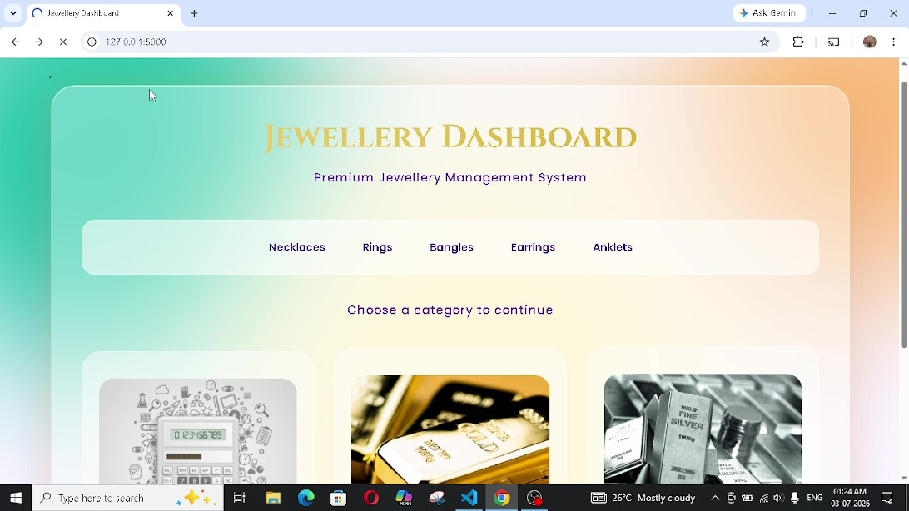
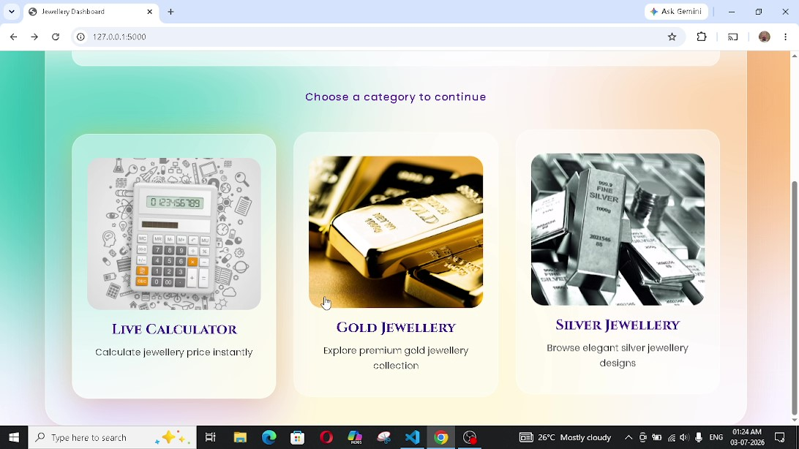
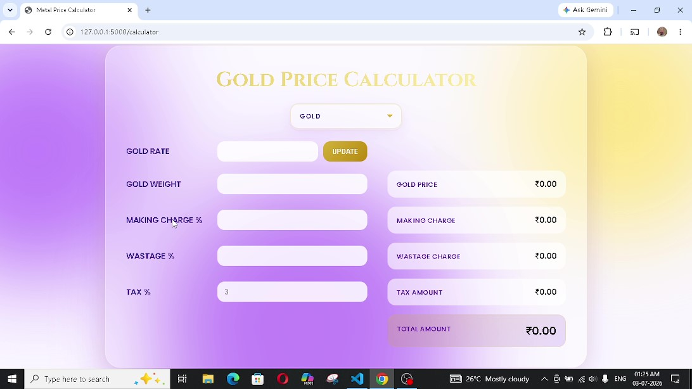
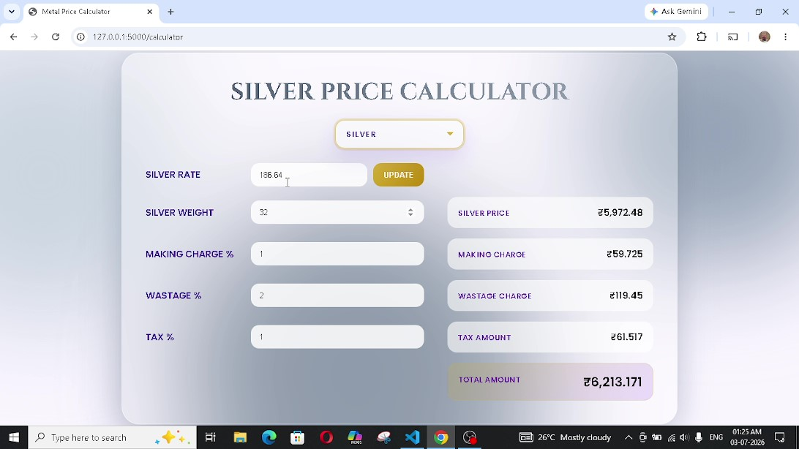
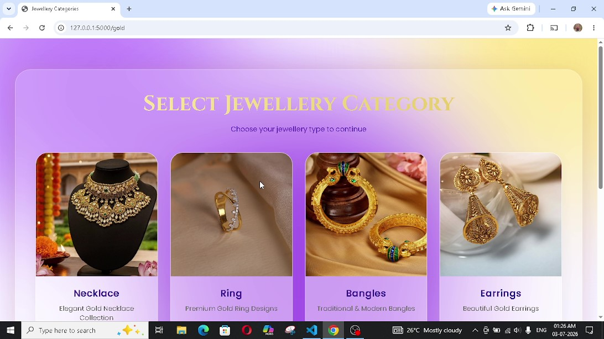
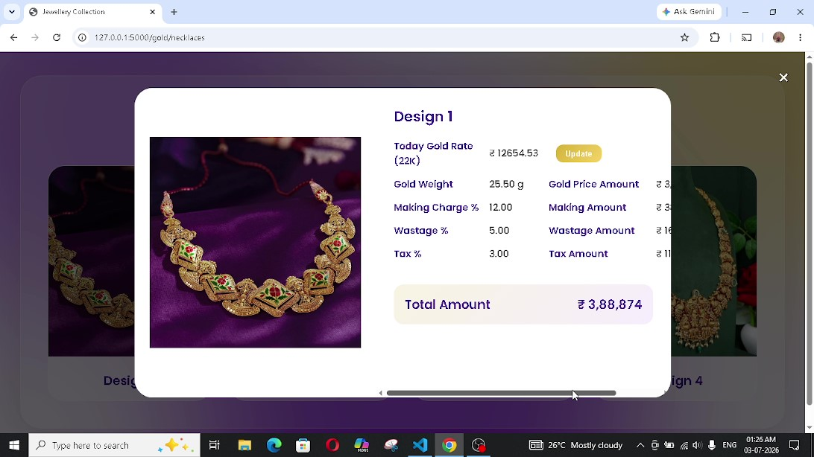
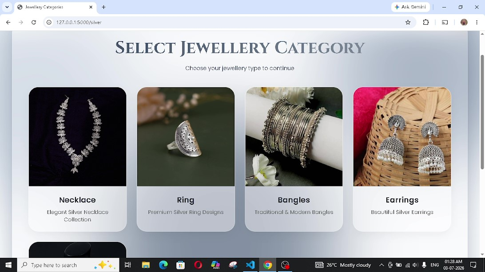
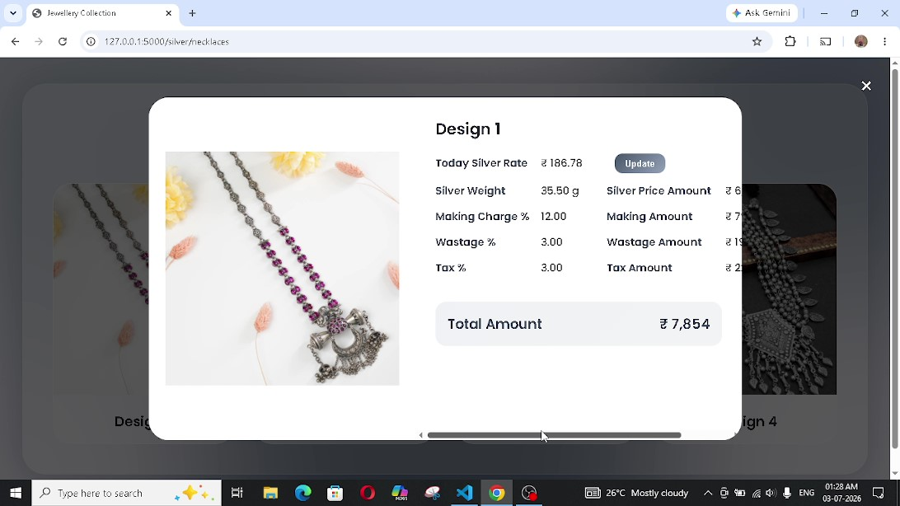

# 💎 Jewellery Website

A responsive Jewellery Website built using **HTML**, **CSS**, **JavaScript**, **Python (Flask)**, and **MySQL**. The website allows users to calculate gold/silver prices with the help of live api connection ,browse jewellery collections and also view its cost by automatic calculation to the current rate.

## 🛠️ Technologies Used

- HTML
- CSS
- JavaScript
- Python (Flask)
- MySQL

## 🚀 How to Run

1. Clone or download the repository.
2. Import the database file into MySQL.
3. Update your MySQL username and password in the Python backend file.
4. Replace "YOUR API KEY" in the html files with your corresponding gold/silver api. 
5. Install the required Python packages.
6. Run the Flask application.
7. Open `http://127.0.0.1:5000` in your web browser.

## 📸 Screenshots

<table>
  <tr>
    <td></td>
    <td></td>
    <td></td>
    <td></td>
  </tr>
  <tr>
    <td></td>
    <td></td>  
    <td></td>
    <td></td>
  </tr>
</table>

## 🎥 Demo Video

[Watch the Demo Video](Jewellery-website/Demovideo/Jewellery-demo.mp4)

## 👩‍💻 Author

**Hema Priya R**
